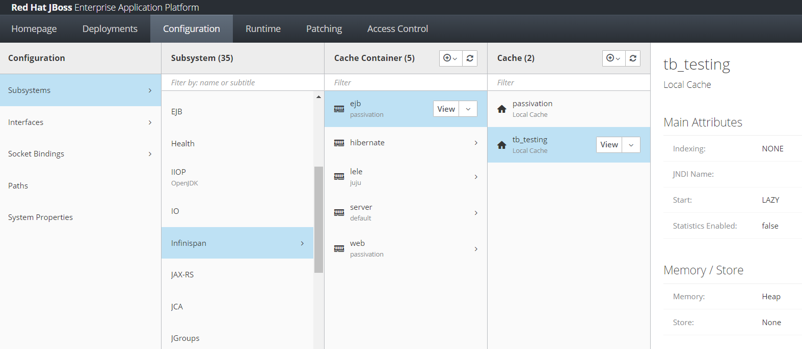
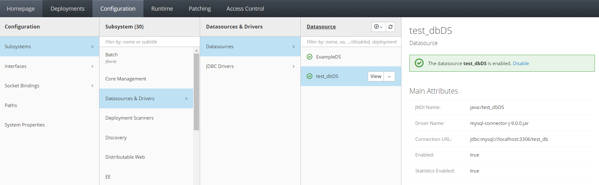

# Measuring Response Speed using Standard SQL Connections, Connection Pooling, and Cached Response

## What is this
A simple way to measure API response speed from 3 different approaches. 

- API with Regular SQL Connections 
- API using ConnectionPool 
- API with cache response

## Direct Query 

### Testing Script
```
for ((i=1;i<=10;i++)); 
	do  
		curl "http://localhost:8080/selectWithDirectSQL" -w '%{time_total}' -o /dev/null -s >> output.txt; 
		echo "" >> output.txt; 
	done
```

### Result

| cycle   | Time     | 
|---------|----------|
| 1       | 0.779537 |
| 2       | 0.747272 |
| 3       | 0.860253 |
| 4       | 0.910569 |
| 5       | 0.830401 |
| 6       | 0.713929 |
| 7       | 0.732589 |
| 8       | 0.774726 |
| 9       | 0.727771 |
| 10      | 0.87738  |
| Total   | 7.954427 |
| Average | 0.795442 |


## Pooled Query

### Testing Script
```
for ((i=1;i<=10;i++)); 
	do  
		curl "http://localhost:8080/selectWithPooledSQL" -w '%{time_total}' -o /dev/null -s >> output.txt; 
		echo "" >> output.txt; 
	done
```

### Result

| cycle   | Time     | 
|---------|----------|
| 1       | 0.614503 |
| 2       | 0.476083 |
| 3       | 0.420366 |
| 4       | 0.419077 |
| 5       | 0.396823 |
| 6       | 0.372535 |
| 7       | 0.377555 |
| 8       | 0.355249 |
| 9       | 0.348123 |
| 10      | 0.534068 |
| Total   | 4.314382 |
| Average | 0.431438 |


## Cached Query

### Testing Script
```
for ((i=1;i<=10;i++)); 
	do  
		curl "http://localhost:8080/selectWithCachedSQL" -w '%{time_total}' -o /dev/null -s >> output.txt; 
		echo "" >> output.txt; 
	done
```

### Result

| cycle   | Time     | 
|---------|----------|
| 1       | 0.214491 |
| 2       | 0.220567 |
| 3       | 0.220238 |
| 4       | 0.222067 |
| 5       | 0.210079 |
| 6       | 0.219475 |
| 7       | 0.204576 |
| 8       | 0.217263 |
| 9       | 0.214521 |
| 10      | 0.223637 |
| Total   | 2.166914 |
| Average | 0.216691 |


## Summary
| Method       | Average  | Summary     |
|--------------|----------|-------------|
| Direct Query | 0.795442 | Baseline    |
| Pooled Query | 0.431438 | ~45% Faster |
| Cached Query | 0.216691 | ~70% Faster |

# JBoss

## Infinispan Configuration


## Datasource Configuration
